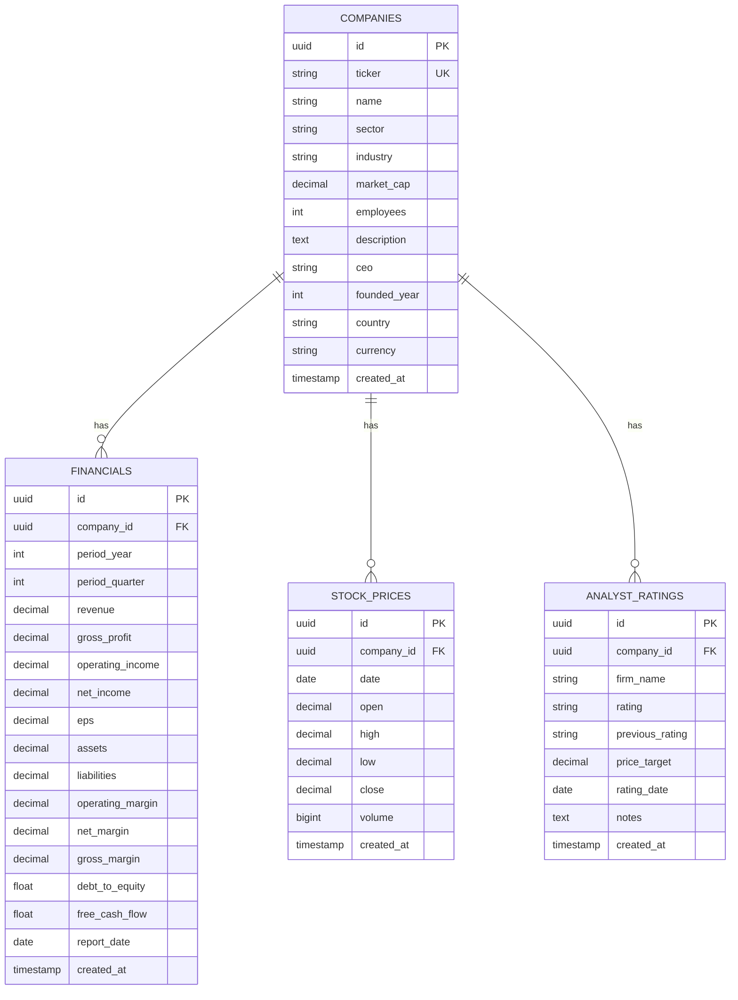

# Database Schema

This document describes the PostgreSQL database schema for the Financial Data MCP Server.

## Entity Relationship Diagram



## Table Definitions

### companies

Core table storing company information.

| Column | Type | Constraints | Description |
|--------|------|-------------|-------------|
| id | UUID | PRIMARY KEY | Unique identifier |
| ticker | VARCHAR(10) | UNIQUE, NOT NULL | Stock ticker symbol |
| name | VARCHAR(255) | NOT NULL | Company name |
| sector | VARCHAR(100) | NOT NULL | Business sector |
| industry | VARCHAR(150) | NOT NULL | Industry classification |
| market_cap | NUMERIC(20,2) | | Market capitalization |
| employees | INTEGER | | Employee count |
| description | TEXT | | Company description |
| ceo | VARCHAR(255) | | CEO name |
| founded_year | INTEGER | | Year founded |
| country | VARCHAR(80) | NOT NULL, DEFAULT 'US' | Country code |
| currency | VARCHAR(10) | NOT NULL, DEFAULT 'USD' | Currency code |
| created_at | TIMESTAMPTZ | DEFAULT NOW() | Creation timestamp |

**Indexes:**
- `ix_companies_ticker` on `ticker` (for lookups by ticker)
- `ix_companies_sector` on `sector` (for sector filtering)
- `ix_companies_market_cap` on `market_cap` (for market cap range queries)

### financials

Quarterly and annual financial reports.

| Column | Type | Constraints | Description |
|--------|------|-------------|-------------|
| id | UUID | PRIMARY KEY | Unique identifier |
| company_id | UUID | FOREIGN KEY (companies.id) | Reference to company |
| period_year | INTEGER | NOT NULL | Fiscal year |
| period_quarter | INTEGER | | Quarter (1-4) or NULL for annual |
| revenue | NUMERIC(20,2) | | Total revenue |
| gross_profit | NUMERIC(20,2) | | Gross profit |
| operating_income | NUMERIC(20,2) | | Operating income |
| net_income | NUMERIC(20,2) | | Net income |
| eps | NUMERIC(10,4) | | Earnings per share |
| assets | NUMERIC(20,2) | | Total assets |
| liabilities | NUMERIC(20,2) | | Total liabilities |
| operating_margin | NUMERIC(8,4) | | Operating margin ratio |
| net_margin | NUMERIC(8,4) | | Net margin ratio |
| gross_margin | NUMERIC(8,4) | | Gross margin ratio |
| debt_to_equity | FLOAT | | Debt to equity ratio |
| free_cash_flow | FLOAT | | Free cash flow |
| report_date | DATE | NOT NULL | Report publication date |
| created_at | TIMESTAMPTZ | DEFAULT NOW() | Creation timestamp |

**Indexes:**
- `ix_financials_company_id` on `company_id` (for company lookups)
- `ix_financials_company_year_quarter` on `(company_id, period_year, period_quarter)` (composite for time-series queries)

### stock_prices

Daily OHLCV (Open, High, Low, Close, Volume) stock prices.

| Column | Type | Constraints | Description |
|--------|------|-------------|-------------|
| id | UUID | PRIMARY KEY | Unique identifier |
| company_id | UUID | FOREIGN KEY (companies.id) | Reference to company |
| date | DATE | NOT NULL | Trading date |
| open | NUMERIC(12,4) | NOT NULL | Opening price |
| high | NUMERIC(12,4) | NOT NULL | Daily high |
| low | NUMERIC(12,4) | NOT NULL | Daily low |
| close | NUMERIC(12,4) | NOT NULL | Closing price |
| volume | BIGINT | NOT NULL | Trading volume |
| created_at | TIMESTAMPTZ | DEFAULT NOW() | Creation timestamp |

**Constraints:**
- Unique constraint on `(company_id, date)` - one price per day per company

**Indexes:**
- `ix_stock_prices_company_id` on `company_id` (for company lookups)
- `ix_stock_prices_date` on `date` (for date range queries)
- `ix_stock_prices_company_date` on `(company_id, date)` (composite for time-series queries)

### analyst_ratings

Analyst ratings and price targets.

| Column | Type | Constraints | Description |
|--------|------|-------------|-------------|
| id | UUID | PRIMARY KEY | Unique identifier |
| company_id | UUID | FOREIGN KEY (companies.id) | Reference to company |
| firm_name | VARCHAR(150) | NOT NULL | Analyst firm name |
| rating | VARCHAR(30) | NOT NULL | Current rating (Strong Buy, Buy, Hold, Underperform, Sell) |
| previous_rating | VARCHAR(30) | | Previous rating (if changed) |
| price_target | NUMERIC(12,2) | | Price target |
| rating_date | DATE | NOT NULL | Rating date |
| notes | TEXT | | Additional notes |
| created_at | TIMESTAMPTZ | DEFAULT NOW() | Creation timestamp |

**Indexes:**
- `ix_analyst_ratings_company_id` on `company_id` (for company lookups)
- `ix_analyst_ratings_date` on `rating_date` (for recent ratings queries)

## Data Volume

Expected data volumes for the seed data:

| Table | Records | Notes |
|-------|---------|-------|
| companies | 20 | One record per company |
| financials | 160 | 8 quarters × 20 companies |
| stock_prices | 1,300 | ~65 trading days × 20 companies |
| analyst_ratings | 80-160 | 4-8 ratings × 20 companies |

## Schema Migrations

Migrations are managed with Alembic:

```bash
# Create new migration
alembic revision -m "description"

# Run migrations
alembic upgrade head

# Rollback one version
alembic downgrade -1
```

See `alembic/versions/` for migration history.
